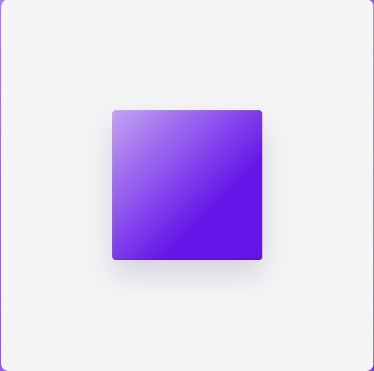
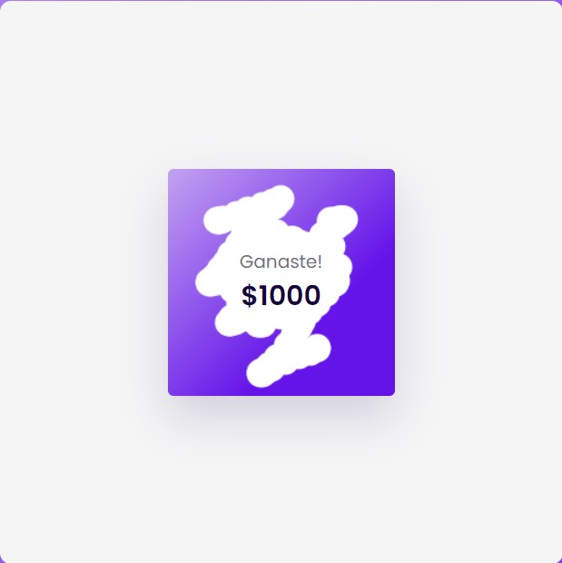

# Raspe-y-Gane
al igual que los raspes de la lotería, este ejemplo imita el concepto en donde raspas un recuadro y ganas un premio. hecho  en HTML, CSS y JavaScript

  
    
  
    
  
  

## ¿Cuál es el fin de este proyecto?
Es una simple pagina hecha en HTML, CSS y JavaScript. 
Su objetivo no es mas que el aprendisaje y practica de herramientas que nos puede proporcionar JavaScript.

## ¿Puedo Probarlo en Linea? 
Si, Puedes probarlo en linea haciendo click [aqui](https://carlosorellana00.github.io/Raspe-y-Gane/)

## ¿Cómo puedo probarlo de manera local en mi equipo?
puede copiarse directamente desde git a traves de comando o descargarse en un archivo Zip, el proyecto no requiere de ningun servicio de servidor para correrse
de manera local en una computadora.

## Modo de uso
la pagina nos muestra un recuadro de color blanco en su centro que tiene un recuadro color purpura en su centro.

    

al pasar el cursor del Mouse sobre el recuadro morado, podremos ver como este empieza a impiarse y nos muestra el texto oculto.

    

al limpiar gran parte de el se nos revelara el mensaje oculto que este tiene

    

## Agradecimientos y Referencias:

- [Autor Original -> Coding Artist](https://www.youtube.com/c/CodingArtist)
- [Video Original -> Scratch Card With Javascript | Step By Step Javascript Project](https://www.youtube.com/watch?v=XYKyywTf-q8)

